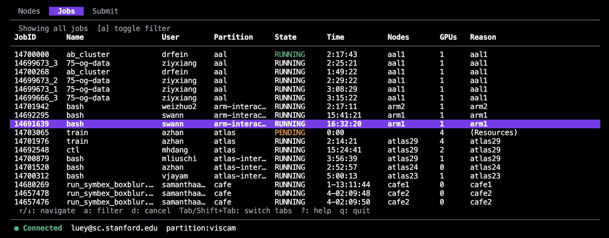
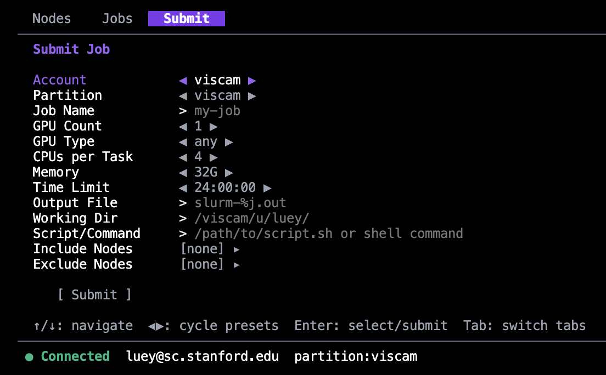
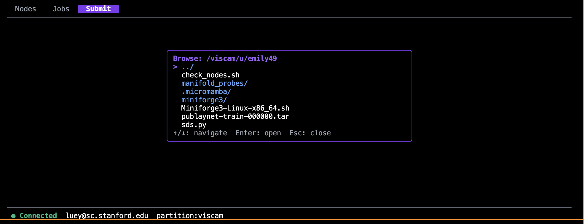
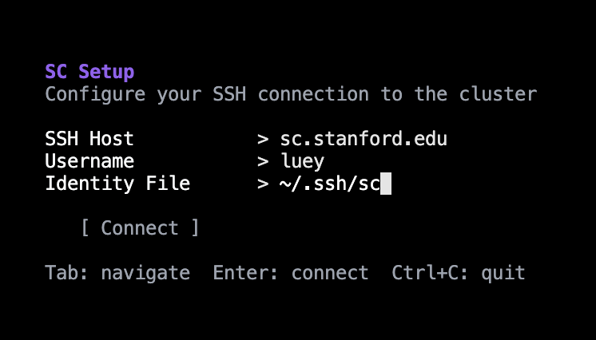

# sc — Stanford Compute Cluster TUI

TUI for managing Slurm jobs on the Stanford SC cluster.

### Jobs
View and manage running jobs with filtering and cancellation support (squeue).



### Submit
Configure and submit new Slurm jobs with preset cycling for common options (srun).



### Remote File Browser
Browse the cluster filesystem to select scripts for submission (cd, ls).



## Install

```bash
curl -sSfL https://raw.githubusercontent.com/christopherluey/sc/main/install.sh | sh
```

Or build from source (requires Go 1.24+):

```bash
git clone https://github.com/christopherluey/sc.git
cd sc
make build
```

## Prerequisites

`sc` connects to the cluster over SSH with key-based authentication. Password auth is not supported.

### Set up SSH keys

```bash
# Generate a key if you don't have one
ssh-keygen -t ed25519

# Copy it to the cluster
ssh-copy-id SUID@sc.stanford.edu

# Verify key auth works (should not prompt for password)
ssh SUID@sc.stanford.edu whoami
```

### VPN

You must be on the Stanford network or connected via VPN to reach `sc.stanford.edu`.

## Usage

```bash
sc
```

On first run, you'll be prompted to configure your SSH connection. Settings are saved to `~/.config/sc/config.toml`.

### Setup
First-run configuration wizard for SSH connection details.



You can also pass flags directly:

```bash
sc --host sc.stanford.edu --user SUID
```

## Keybindings

| Key | Action |
|-----|--------|
| `1` / `2` / `3` | Switch to Nodes / Jobs / Submit tab |
| `Tab` / `Shift+Tab` | Cycle tabs |
| `r` | Refresh data |
| `?` | Toggle help |
| `q` / `Ctrl+C` | Quit |

### Jobs tab

| Key | Action |
|-----|--------|
| `a` | Toggle between my jobs / all jobs |
| `d` | Cancel selected job |
| `y` / `n` | Confirm / deny cancel |

### Submit tab

| Key | Action |
|-----|--------|
| `Tab` / `Shift+Tab` | Navigate fields |
| `Enter` | Submit job |
